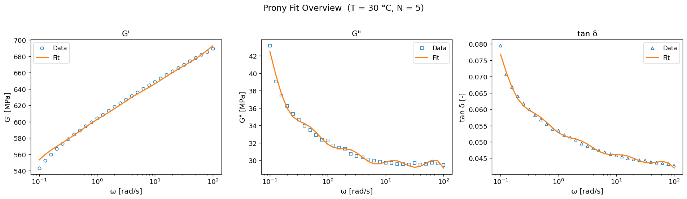
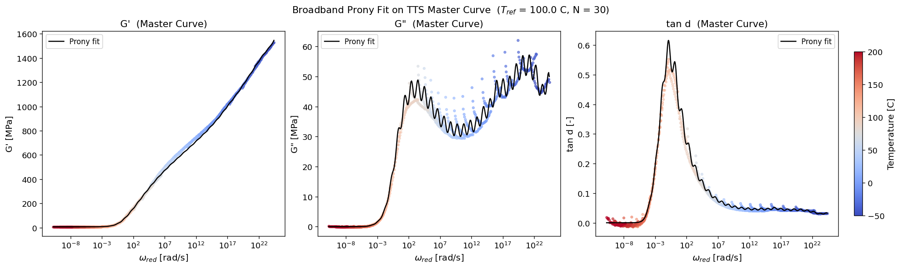
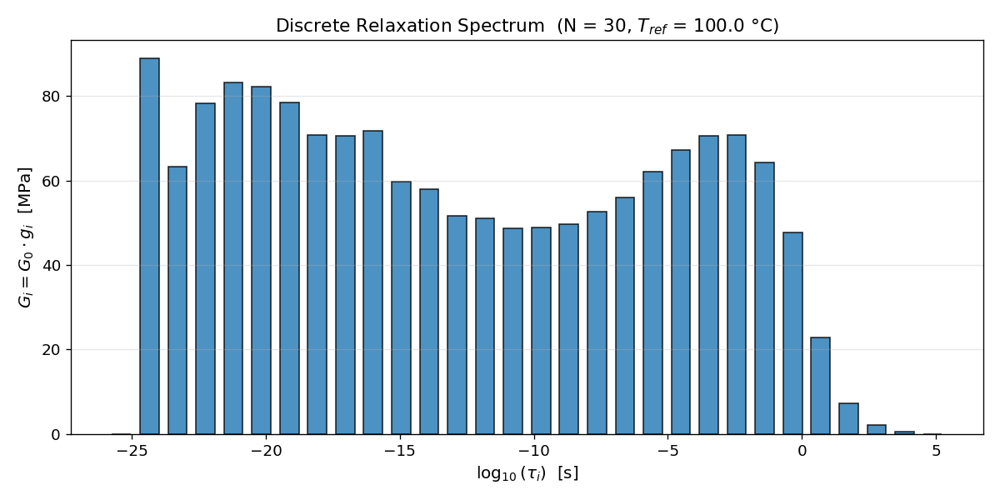

# Thermo-Viscoelastic Identification from DMA: TTS Master Curve + Prony Series

Identify generalized Maxwell (Prony series) parameters from multi-temperature DMA frequency sweeps using Time-Temperature Superposition (TTS) master curves (WLF/Arrhenius shift factors) and export FE-ready material cards.

## Dataset

[Henkel Teroson EP5089 DMA data](https://doi.org/10.17632/k6pggf8zxw.1) (Mendeley Data) - temperature-frequency sweep on a cured epoxy thermoset. 26 temperatures (-50 to 200 C), 0.1-100 Hz, 806 data points total.

## What it does

**Notebook 01** - Single-temperature Prony fit at T = 30 C:
- Fit N = 5 Prony terms via bounded least-squares on G' and G'' simultaneously
- G' relative error < 0.4%, G'' < 1%
- Sensitivity analysis (N = 2-8) shows diminishing returns beyond N = 5
- Export to CSV, JSON, and Abaqus `*VISCOELASTIC` format

**Notebook 02** - TTS master curve + broadband fit:
- Build master curve from all 26 temperatures using provided shift factors
- Fit WLF and Arrhenius models to shift factors (Arrhenius wins for this wide T range, Ea = 257 kJ/mol)
- N = 30 broadband Prony series via collocation method (fixed log-spaced tau)
- G' error 3.2%, G'' error 6.9% on filtered data

## Results

### Single-temperature fit (T = 30 C, N = 5)

| Quantity | Value |
|---|---|
| G0 (glassy) | 716.9 MPa |
| G_eq (equilibrium) | 486.9 MPa |
| G' rel. error | 0.37% |
| G'' rel. error | 0.85% |



### TTS master curve (T_ref = 100 C, N = 30)

| Quantity | Value |
|---|---|
| Frequency span | ~35 decades |
| G0 (glassy) | 1586.5 MPa |
| G_eq (equilibrium) | 6.9 MPa |
| Arrhenius Ea | 256.6 kJ/mol |





## Repository structure

```
data/raw/                     # original DMA Excel file (not tracked, download from Mendeley)
notebooks/
    01_dma_to_prony.ipynb     # single-temperature Prony fit
    02_tts_master_curve.ipynb # TTS master curve + broadband Prony
src/
    io.py                     # data loading and slicing
    model.py                  # Prony series equations
    fit.py                    # least-squares fitting + collocation
    validate.py               # plotting and error metrics
    export.py                 # CSV/JSON/Abaqus export
    tts.py                    # TTS, WLF, Arrhenius
results/
    figures/                  # generated plots
    tables/                   # Prony params, metrics, master curve data
```

## Setup

```bash
conda env create -f environment.yml
conda activate dma-prony
```

Or with pip: `numpy scipy pandas matplotlib openpyxl ipykernel`

Then run the notebooks in order. Download the dataset Excel file into `data/raw/` first.

## References

- DMA data: [10.17632/k6pggf8zxw.1](https://doi.org/10.17632/k6pggf8zxw.1)
